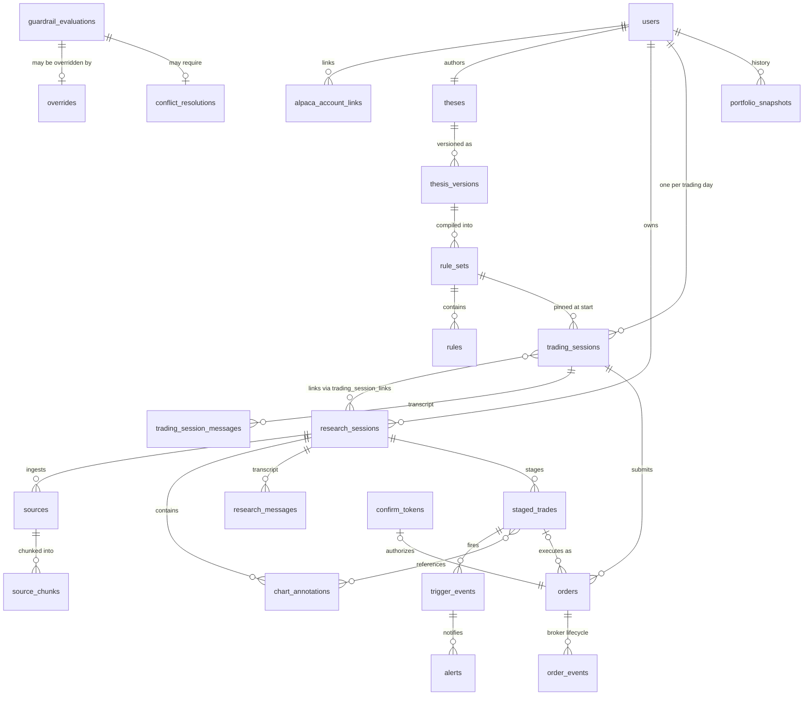
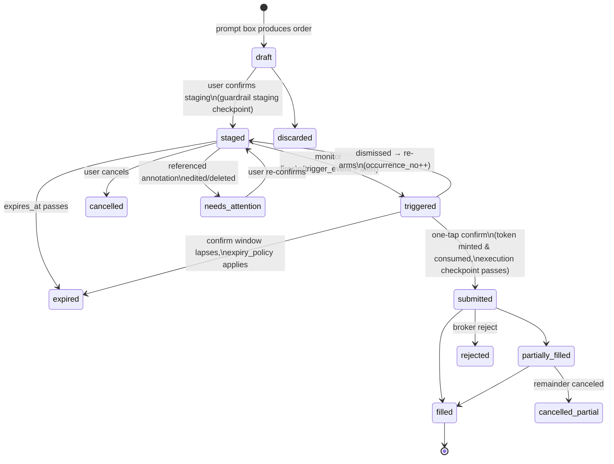

# Data Model: Thesis-Driven Trading Workbench

**Status:** Draft v1 — companion to [`thesis-trading-app-prd.md`](./thesis-trading-app-prd.md)

This document defines the persistent data model implied by the PRD. Field
types are PostgreSQL-flavored. Every design choice traces back to a PRD
decision; where the PRD forced a non-obvious modeling choice, the rationale
is called out inline.

---

## 1. Design principles

1. **Append-only where audit matters.** Thesis versions, compiled rules,
   session transcripts, guardrail evaluations, order events, and the audit
   log are immutable once written (enforced by revoking `UPDATE`/`DELETE`
   on those tables, not by convention). Mutable working state (a staged
   trade's status) changes only via recorded transitions.
2. **Snapshot-at-use.** Every consequential decision row pins the exact
   version of what it was decided under: trading sessions pin a
   `rule_set_id` at start, guardrail evaluations pin the rule set they ran
   against, orders pin the payload hash the user confirmed. This is what
   makes "audit any past trade against the rules in force at execution"
   possible (PRD §3.5, §6).
3. **The trade object is the Alpaca request, verbatim.** From the moment the
   floating prompt box produces an order, it is stored as the literal Alpaca
   API payload (PRD §3.3). Nothing downstream re-interprets intent; systems
   only validate, gate, and transmit it.
4. **Chart geometry lives in data coordinates, not pixels.** Annotations are
   stored as anchors in (time, price) space so the trigger monitor can
   compute a trendline's price at any future moment (PRD §6, server-side
   trigger monitor).
5. **Single-leg invariant.** One instrument per order — enforced as a DB
   check and an application-level schema constraint (PRD §4 order scope).
6. **License class travels with content.** Every ingested source carries a
   `license_class` that gates whether its text may be stored, excerpted, or
   only displayed (PRD §5 citability requirement).

---

## 2. Entity overview



---

## 3. Identity & brokerage

### 3.1 `users`

| Field | Type | Notes |
|---|---|---|
| `id` | `uuid` PK | |
| `email` | `text` unique | |
| `auth_provider`, `auth_subject` | `text` | external IdP identity |
| `display_name` | `text` | |
| `status` | `enum('active','suspended','closed')` | |
| `created_at` | `timestamptz` | |

### 3.2 `alpaca_account_links`

BYO-Alpaca via OAuth (PRD §4). One link per mode.

| Field | Type | Notes |
|---|---|---|
| `id` | `uuid` PK | |
| `user_id` | `uuid` FK → users | unique with `mode` |
| `mode` | `enum('paper','live')` | v1 issues `paper` only; schema is live-ready for v1.x |
| `alpaca_account_id` | `text` | |
| `access_token_enc`, `refresh_token_enc` | `bytea` | envelope-encrypted; never logged |
| `scopes` | `text[]` | |
| `options_approval_level` | `smallint` | **cached, read from Alpaca, never authored by us** — users bring their own account, so this is a fact we read; `refreshed_at` tracks staleness |
| `refreshed_at` | `timestamptz` | |
| `status` | `enum('active','revoked','error')` | |
| `linked_at` | `timestamptz` | |

The guardrail engine treats "account level doesn't permit this order"
(e.g., naked STO) as a distinct, non-overridable failure class — it is
Alpaca's constraint, not a thesis rule.

---

## 4. Strategy layer: thesis & compiled rules

### 4.1 `theses`

| Field | Type | Notes |
|---|---|---|
| `id` | `uuid` PK | |
| `user_id` | `uuid` FK, **unique in v1** | PRD says one overarching thesis; dropping the unique constraint later enables multiple theses without migration pain |
| `created_at` | `timestamptz` | |

### 4.2 `thesis_versions`

Every edit creates a new version. Immutable once activated.

| Field | Type | Notes |
|---|---|---|
| `id` | `uuid` PK | |
| `thesis_id` | `uuid` FK | |
| `version_no` | `int` | monotonic per thesis |
| `body_text` | `text` | the natural-language thesis, verbatim |
| `status` | `enum('draft','active','superseded')` | partial unique index: one `active` per thesis |
| `created_at`, `activated_at` | `timestamptz` | |

### 4.3 `rule_sets`

A compilation of one thesis version into structured rules (PRD §3.1).
Rule sets are immutable; **promotion of a conflict resolution into the
rules creates a new rule set** (old rules + promoted rule) with lineage via
`parent_rule_set_id`. This keeps snapshot-at-use clean: a pinned
`rule_set_id` always means exactly one frozen set of rules.

| Field | Type | Notes |
|---|---|---|
| `id` | `uuid` PK | |
| `thesis_version_id` | `uuid` FK | |
| `parent_rule_set_id` | `uuid` FK nullable | lineage for promotions |
| `compiler_model_id` | `text` | pinned LLM version that compiled it |
| `compiler_prompt_version` | `text` | |
| `status` | `enum('pending_review','active','superseded')` | the user **reviews and confirms** compiled rules before activation — the rules are the enforced contract, so the user must see them |
| `user_confirmed_at` | `timestamptz` | |
| `compiled_at` | `timestamptz` | |

### 4.4 `rules`

| Field | Type | Notes |
|---|---|---|
| `id` | `uuid` PK | |
| `rule_set_id` | `uuid` FK | |
| `kind` | `enum('deterministic','qualitative')` | deterministic rules are machine-checked per order; qualitative rules are NL predicates the guardrail engine's LLM pass evaluates (PRD §3.1 hybrid) |
| `rule_type` | `text` | taxonomy: `max_position_pct`, `max_ticker_concentration_pct`, `max_order_notional`, `sector_allowlist`, `sector_blocklist`, `ticker_allowlist`, `ticker_blocklist`, `earnings_window_block`, `max_daily_trades`, `asset_class_constraint`, `option_action_constraint` (e.g., "no STO"), `custom_qualitative` |
| `params` | `jsonb` | typed per `rule_type`, schema-validated |
| `severity` | `enum('friction','advisory')` | `friction` = soft-block screen with override (PRD §3.2); `advisory` = console flag only |
| `source` | `enum('thesis_compile','conflict_promotion')` | provenance |
| `source_text_span` | `jsonb` | `{start, end, quote}` offsets into the thesis body that produced this rule — lets the friction screen show *why* in the user's own words |
| `conflict_resolution_id` | `uuid` FK nullable | set when `source = 'conflict_promotion'` |
| `created_at` | `timestamptz` | |

```sql
-- Load-bearing: rules are immutable and traceable to their origin
CREATE TABLE rules (
  id                      uuid PRIMARY KEY DEFAULT gen_random_uuid(),
  rule_set_id             uuid NOT NULL REFERENCES rule_sets(id),
  kind                    rule_kind NOT NULL,
  rule_type               text NOT NULL,
  params                  jsonb NOT NULL,
  severity                rule_severity NOT NULL DEFAULT 'friction',
  source                  rule_source NOT NULL,
  source_text_span        jsonb,
  conflict_resolution_id  uuid REFERENCES conflict_resolutions(id),
  created_at              timestamptz NOT NULL DEFAULT now(),
  CHECK ((source = 'conflict_promotion') = (conflict_resolution_id IS NOT NULL))
);
REVOKE UPDATE, DELETE ON rules FROM app_rw;
```

---

## 5. Research sessions (durable)

### 5.1 `research_sessions`

| Field | Type | Notes |
|---|---|---|
| `id` | `uuid` PK | |
| `user_id` | `uuid` FK | |
| `title` | `text` | |
| `focus_type` | `enum('ticker','theme')` | PRD §3.3: single ticker or theme |
| `focus_tickers` | `text[]` | one entry for ticker focus; many for themes |
| `description` | `text` | |
| `status` | `enum('active','archived')` | never deleted — staged trades and citations reference these |
| `created_at`, `updated_at`, `archived_at` | `timestamptz` | |

### 5.2 `sources`

Everything a research session ingests (PRD §3.3): live news pinned/cited,
filings, PDFs, imported knowledge, and **past trading-session transcripts
ingested as learning** (PRD §3.5).

| Field | Type | Notes |
|---|---|---|
| `id` | `uuid` PK | |
| `research_session_id` | `uuid` FK | |
| `source_type` | `enum('news_article','edgar_filing','pdf_upload','imported_knowledge','trading_session_transcript','web_page')` | |
| `title`, `publisher` | `text` | |
| `published_at` | `timestamptz` | |
| `external_uri` | `text` | provider permalink / EDGAR accession URL |
| `storage_key` | `text` | object-store key for uploaded blobs (PDFs) |
| `linked_trading_session_id` | `uuid` FK nullable | set when `source_type = 'trading_session_transcript'` |
| `content_hash` | `text` | sha256; unique with `research_session_id` to dedupe |
| `license_class` | `enum('storable','excerpt_only','display_only')` | gates chunk storage (see §5.3); EDGAR/Alpaca → `storable`, verify per provider (PRD §5) |
| `metadata` | `jsonb` | tickers mentioned, provider item id, sentiment, etc. |
| `ingested_at` | `timestamptz` | |

Live news feed items are **ephemeral** — they stream through the research
view but are only materialized into `sources` when the user pins them or
the AI cites them. This keeps storage proportional to what matters and
license exposure minimal.

### 5.3 `source_chunks`

Retrieval substrate for the research agent (pgvector).

| Field | Type | Notes |
|---|---|---|
| `id` | `uuid` PK | |
| `source_id` | `uuid` FK | |
| `chunk_index` | `int` | |
| `text` | `text` **nullable** | NULL when parent `license_class = 'display_only'` — metadata-only chunks force live fetch at render time, so we never store content we may not store |
| `token_count` | `int` | |
| `embedding` | `vector(1536)` | with `embedding_model_id` so re-embedding is trackable |
| `embedding_model_id` | `text` | |

### 5.4 `chart_annotations`

The drawings the floating prompt box converts into trades, and the trigger
monitor later evaluates.

| Field | Type | Notes |
|---|---|---|
| `id` | `uuid` PK | |
| `research_session_id` | `uuid` FK | |
| `symbol` | `text` | underlying the drawing applies to |
| `annotation_type` | `enum('trendline','hline','zone','fib_retracement','note')` | |
| `axis_basis` | `enum('bar_index','wall_clock')` | **critical subtlety:** a trendline drawn on a daily chart is linear in *bar index*, not wall-clock time — overnight gaps and weekends would otherwise bend the line. The monitor must reproduce exactly the line the user drew |
| `timeframe` | `text` | e.g. `1D`, `15m` — needed to map bar index ↔ time |
| `geometry` | `jsonb` | anchors: `[{t: timestamptz, bar: int, p: numeric}, ...]`; trendline = 2 anchors + linear extrapolation; zone = price band; hline = single price |
| `extension` | `enum('none','right','both')` | how far the line projects |
| `label`, `style` | `text`, `jsonb` | display only |
| `status` | `enum('active','deleted')` | **soft delete only** — staged trades may reference annotations; hard delete is blocked while any non-terminal staged trade references it (§6.2) |
| `created_at`, `updated_at` | `timestamptz` | |

### 5.5 `research_messages`

Append-only transcript of the research session's AI conversation, with
citations — the "news must be citable" requirement (PRD §5).

| Field | Type | Notes |
|---|---|---|
| `id` | `uuid` PK | |
| `research_session_id` | `uuid` FK | |
| `seq` | `bigint` | unique with session id; strict ordering |
| `role` | `enum('user','assistant','system','tool')` | |
| `content` | `jsonb` | text and/or structured blocks |
| `tool_calls` | `jsonb` | calls + results, for replay |
| `citations` | `jsonb` | `[{source_id, chunk_id, quote_span}]` — every grounded claim points at a stored source |
| `model_id`, `prompt_version` | `text` | pinned versions, for replay/eval |
| `created_at` | `timestamptz` | |

---

## 6. Staged trades & triggers

### 6.1 `staged_trades`

The heart of the research → trading handoff. Persist until filled, expired,
or cancelled (PRD §3.3).

| Field | Type | Notes |
|---|---|---|
| `id` | `uuid` PK | |
| `research_session_id` | `uuid` FK | |
| `user_id` | `uuid` FK | denormalized for monitor queries |
| `status` | see state machine §9.1 | |
| `asset_class` | `enum('us_equity','us_option')` | |
| `order_payload` | `jsonb` | **verbatim Alpaca order request** — equities: `{symbol, qty, side, type, time_in_force, limit_price?, stop_price?}`; options: adds OCC contract symbol and `position_intent ∈ {buy_to_open, sell_to_close, sell_to_open, buy_to_close}`. CHECK: no `legs` key, exactly one instrument (PRD §4 single-leg) |
| `payload_hash` | `text` | sha256 of canonicalized `order_payload`; what confirm tokens bind to |
| `trigger_expression` | `jsonb` | AST, see §6.3; NULL = "execute on next confirm" with no market condition |
| `expires_at` | `timestamptz` nullable | |
| `expiry_policy` | `enum('cancel','notify')` | |
| `created_from` | `jsonb` | provenance: `{prompt_text, research_message_id, annotation_ids[]}` — the exact words and drawings that produced this order |
| `staging_evaluation_id` | `uuid` FK → guardrail_evaluations | guardrail result at staging time |
| `rule_set_id_at_staging` | `uuid` FK | snapshot-at-use |
| `version` | `int` | optimistic lock — drafts are user-editable |
| `created_at`, `updated_at` | `timestamptz` | |

```sql
CREATE TABLE staged_trades (
  id                      uuid PRIMARY KEY DEFAULT gen_random_uuid(),
  research_session_id     uuid NOT NULL REFERENCES research_sessions(id),
  user_id                 uuid NOT NULL REFERENCES users(id),
  status                  staged_trade_status NOT NULL DEFAULT 'draft',
  asset_class             asset_class NOT NULL,
  order_payload           jsonb NOT NULL,
  payload_hash            text NOT NULL,
  trigger_expression      jsonb,
  expires_at              timestamptz,
  expiry_policy           expiry_policy NOT NULL DEFAULT 'notify',
  created_from            jsonb NOT NULL,
  staging_evaluation_id   uuid REFERENCES guardrail_evaluations(id),
  rule_set_id_at_staging  uuid NOT NULL REFERENCES rule_sets(id),
  version                 int NOT NULL DEFAULT 1,
  created_at              timestamptz NOT NULL DEFAULT now(),
  updated_at              timestamptz NOT NULL DEFAULT now(),
  -- single-leg invariant (PRD §4)
  CHECK (NOT order_payload ? 'legs')
);
-- the trigger monitor's working-set query
CREATE INDEX idx_staged_armed ON staged_trades (user_id, status)
  WHERE status = 'staged';
```

### 6.2 `staged_trade_annotation_refs`

Annotation references extracted from the trigger AST into a join table —
pure jsonb references can't carry referential integrity.

| Field | Type | Notes |
|---|---|---|
| `staged_trade_id` | `uuid` FK | composite PK |
| `annotation_id` | `uuid` FK | composite PK |

Behavior this enables: editing a referenced annotation re-arms the trigger
against the new geometry and notifies the user; soft-deleting one flags
every dependent staged trade as `needs_attention` rather than silently
breaking it.

### 6.3 Trigger expression AST

Stored in `staged_trades.trigger_expression`. The trigger monitor (pure
deterministic service, PRD §6) evaluates these against Alpaca streams.

```jsonc
{
  "op": "and",                      // and | or
  "children": [
    {
      "pred": "price_cross",
      "symbol": "AAPL",
      "ref": { "kind": "annotation", "annotation_id": "…" },  // or {"kind":"static_level","price":200}
      "direction": "below",          // above | below | touch
      "confirmation": { "bars": 1, "timeframe": "15m" }       // optional debounce
    },
    { "pred": "time_window", "after": "09:45-05:00", "before": "15:30-05:00" },
    { "pred": "volume_above", "symbol": "AAPL", "multiple_of_avg": 1.5, "lookback_days": 20 }
  ]
}
```

Leaf predicates in v1: `price_cross` (static level or annotation-derived —
for trendlines the monitor computes `price_at(now)` from the stored
geometry), `time_window`, `volume_above`. The AST shape means indicator
and event predicates are additive later without schema change.

### 6.4 `trigger_events`

One row per firing. A staged trade can fire more than once (user dismisses,
trigger re-arms), tracked by `occurrence_no`.

| Field | Type | Notes |
|---|---|---|
| `id` | `uuid` PK | |
| `staged_trade_id` | `uuid` FK | |
| `occurrence_no` | `int` | |
| `fired_at` | `timestamptz` | |
| `condition_snapshot` | `jsonb` | evaluated values at fire time: last price, computed trendline price, volume ratio — the audit answer to "why did this fire?" |
| `market_snapshot` | `jsonb` | bid/ask/last + timestamps |
| `monitor_node_id` | `text` | which monitor instance fired it |
| `outcome` | `enum('confirmed','dismissed','expired_unconfirmed','superseded')` | |
| `outcome_at` | `timestamptz` | `outcome_at - fired_at` = confirm latency, a key product metric |

### 6.5 `alerts`

| Field | Type | Notes |
|---|---|---|
| `id` | `uuid` PK | |
| `user_id` | `uuid` FK | |
| `trigger_event_id` | `uuid` FK | |
| `channel` | `enum('in_app','push','email')` | v1: in_app; push arrives with the mobile companion |
| `sent_at`, `delivered_at`, `acknowledged_at` | `timestamptz` | |

---

## 7. Trading sessions & execution

### 7.1 `trading_sessions`

One per user per trading day (PRD §3.4). Unique `(user_id, trading_date)`.

| Field | Type | Notes |
|---|---|---|
| `id` | `uuid` PK | |
| `user_id` | `uuid` FK | |
| `trading_date` | `date` | from the market calendar, not wall clock |
| `mode` | `enum('paper','live')` | |
| `rule_set_id` | `uuid` FK | **pinned at session start** (PRD §3.1: rules fetched once per session). A session cannot start without an active rule set — onboarding forces thesis creation |
| `status` | `enum('active','archived')` | archived at EOD or next sign-in, never deleted (PRD §3.5 audit) |
| `summary` | `text` | AI-generated end-of-day recap, written at archive time; this is what gets cheaply ingested into research sessions as learning |
| `started_at`, `ended_at` | `timestamptz` | |

### 7.2 `trading_session_links`

| Field | Type | Notes |
|---|---|---|
| `trading_session_id` | `uuid` FK | composite PK |
| `research_session_id` | `uuid` FK | composite PK |
| `linked_at` | `timestamptz` | |

Linking exposes the research session's staged trades and context to the
trading session (PRD §3.4).

### 7.3 `trading_session_messages`

Identical shape to `research_messages` (§5.5) — append-only, immutable,
with pinned `model_id`/`prompt_version` and full `tool_calls`. This
transcript IS the audit record of agent behavior (PRD §3.5) and the raw
material for transcript ingestion.

### 7.4 `confirm_tokens`

The one-tap confirm, modeled as a **capability**: a single-use, short-lived
token minted only by the UI tap and bound to the exact payload hash. The
execution service refuses any order not accompanied by a valid token. No
agent can fabricate one — this is the data-level enforcement of "the user
is the decision-maker."

| Field | Type | Notes |
|---|---|---|
| `id` | `uuid` PK | |
| `user_id` | `uuid` FK | |
| `payload_hash` | `text` | must equal the hash of the payload submitted with it |
| `staged_trade_id` | `uuid` FK nullable | NULL for ad-hoc plain-English orders |
| `issued_at` | `timestamptz` | |
| `expires_at` | `timestamptz` | short TTL (~60s); expiry forces a fresh look at the market |
| `consumed_at` | `timestamptz` nullable | single-use: consumption is an atomic compare-and-set |

### 7.5 `orders`

| Field | Type | Notes |
|---|---|---|
| `id` | `uuid` PK | |
| `user_id`, `trading_session_id` | `uuid` FK | |
| `staged_trade_id` | `uuid` FK nullable | NULL = ad-hoc plain-English order |
| `alpaca_account_link_id` | `uuid` FK | |
| `mode` | `enum('paper','live')` | denormalized; must match the link |
| `client_order_id` | `uuid` unique | **idempotency key sent to Alpaca** — retries can never double-submit |
| `alpaca_order_id` | `text` | broker-assigned |
| `payload_sent` | `jsonb` | exact request transmitted |
| `payload_hash` | `text` | must match the consumed confirm token |
| `confirm_token_id` | `uuid` FK NOT NULL | every order proves its human authorization |
| `exec_evaluation_id` | `uuid` FK → guardrail_evaluations | the **execution-checkpoint** guardrail run (see §8) |
| `status` | `enum('pending_submit','accepted','new','partially_filled','filled','canceled','expired','rejected','failed')` | mirrors Alpaca lifecycle + our pre-submit states |
| `filled_qty`, `filled_avg_price` | `numeric` | |
| `submitted_at`, `filled_at` | `timestamptz` | |
| `created_at` | `timestamptz` | |

### 7.6 `order_events`

Append-only mirror of Alpaca's order-update stream.

| Field | Type | Notes |
|---|---|---|
| `id` | `uuid` PK | |
| `order_id` | `uuid` FK | |
| `event_type` | `text` | `new`, `fill`, `partial_fill`, `canceled`, `rejected`, … |
| `raw` | `jsonb` | broker payload verbatim |
| `occurred_at`, `received_at` | `timestamptz` | broker time vs our time — the gap is a latency health metric |

---

## 8. Guardrails, conflicts & audit

### 8.1 `guardrail_evaluations`

Guardrails run at **two checkpoints**: `staging` (when a trade is staged in
research, against the research-time rule set) and `execution` (at confirm
time, against the trading session's pinned rule set). Staging approval is
never sufficient on its own — rules may have changed between research day
and execution day.

| Field | Type | Notes |
|---|---|---|
| `id` | `uuid` PK | |
| `user_id` | `uuid` FK | |
| `subject_type` | `enum('staged_trade','order')` | |
| `subject_id` | `uuid` | |
| `checkpoint` | `enum('staging','execution')` | |
| `rule_set_id` | `uuid` FK | snapshot-at-use |
| `outcome` | `enum('pass','violation','conflict','broker_constraint')` | `broker_constraint` = non-overridable (e.g., options approval level) |
| `deterministic_results` | `jsonb` | `[{rule_id, pass, measured_value, threshold, explanation}]` per rule |
| `qualitative_result` | `jsonb` | `{consistent, reasoning, model_id, prompt_version}` — the LLM thesis-consistency pass |
| `evaluated_at` | `timestamptz` | |
| `latency_ms` | `int` | guardrails sit on the confirm path; latency is a budgeted SLO |

### 8.2 `overrides`

Soft-block override record (PRD §3.2). Feeds the thesis-drift view.

| Field | Type | Notes |
|---|---|---|
| `id` | `uuid` PK | |
| `guardrail_evaluation_id` | `uuid` FK unique | |
| `confirmed_at` | `timestamptz` | |
| `acknowledgment_text` | `text` | exactly what the friction screen showed — the user overrode *this text* |
| `user_note` | `text` nullable | optional "why" |

### 8.3 `conflict_resolutions`

The multiple-choice intent-capture flow (PRD §3.2).

| Field | Type | Notes |
|---|---|---|
| `id` | `uuid` PK | |
| `guardrail_evaluation_id` | `uuid` FK | |
| `questions` | `jsonb` | `[{question, options[], trade_context}]` as presented |
| `answers` | `jsonb` | as selected |
| `resolution_summary` | `text` | |
| `promoted` | `bool` | |
| `promoted_rule_set_id` | `uuid` FK nullable | the *new* rule set created when the resolution is promoted (see §4.3 immutable-set model) |
| `resolved_at` | `timestamptz` | |

### 8.4 `audit_log`

Generic append-only journal across all domains; the tables above are the
detailed records, this is the unified timeline.

| Field | Type | Notes |
|---|---|---|
| `id` | `bigserial` PK | |
| `occurred_at` | `timestamptz` | |
| `actor_type` | `enum('user','agent','system')` | |
| `actor_id` | `text` | user id or agent name+version |
| `action` | `text` | `trade.staged`, `order.submitted`, `override.confirmed`, `rule_set.promoted`, … |
| `entity_type`, `entity_id` | `text`, `uuid` | |
| `payload` | `jsonb` | |
| `trace_id` | `text` | joins to observability traces |
| `prev_hash`, `row_hash` | `text` | optional hash chain for tamper evidence — cheap to add now, valuable if regulated recordkeeping (17a-4-style) ever applies |

---

## 9. Portfolio

### 9.1 `portfolio_snapshots`

Positions and P&L are read live from Alpaca — we are not the books of
record. Snapshots exist for history charting and thesis-drift trends.

| Field | Type | Notes |
|---|---|---|
| `id` | `uuid` PK | |
| `user_id` | `uuid` FK | |
| `mode` | `enum('paper','live')` | |
| `taken_at` | `timestamptz` | |
| `equity`, `cash`, `buying_power` | `numeric` | |
| `positions` | `jsonb` | `[{symbol, asset_class, qty, avg_entry, market_value, unrealized_pl}]` |
| `trigger` | `enum('scheduled','session_start','session_end')` | |

---

## 10. State machines

### 10.1 Staged trade lifecycle



Terminal states: `filled`, `cancelled`, `cancelled_partial`, `expired`,
`rejected`, `discarded`. Confirmed orders are submitted as **limit orders
at the staged price** so confirm-latency slippage means no fill, not a bad
fill (PRD §6).

### 10.2 Trading session lifecycle

`active` → `archived`. Archival happens at end of trading day or on the
user's next sign-in (whichever first), writes the AI `summary`, and makes
the transcript available as an ingestible source. No other states; no
deletion.

### 10.3 Order lifecycle

Mirrors Alpaca's order states verbatim, driven by `order_events` from the
broker stream — we never infer order state, we record what Alpaca tells us.

---

## 11. Cross-cutting invariants

1. **No order without a consumed confirm token** whose `payload_hash`
   matches `orders.payload_hash` (FK + service-layer atomic check).
2. **Single-leg**: `order_payload` contains exactly one instrument;
   `CHECK (NOT order_payload ? 'legs')` plus schema validation upstream.
3. **Append-only enforcement** via revoked `UPDATE`/`DELETE` on:
   `thesis_versions` (post-activation), `rule_sets`, `rules`,
   `research_messages`, `trading_session_messages`,
   `guardrail_evaluations`, `overrides`, `conflict_resolutions`,
   `trigger_events`, `order_events`, `audit_log`.
4. **Snapshot-at-use**: `trading_sessions.rule_set_id`,
   `staged_trades.rule_set_id_at_staging`,
   `guardrail_evaluations.rule_set_id`, `orders.payload_hash` are all
   NOT NULL — there is no path to a decision without a pinned context.
5. **Annotations referenced by non-terminal staged trades cannot be
   hard-deleted**; edits flow through `needs_attention`.
6. **`source_chunks.text` is NULL iff parent `license_class =
   'display_only'`** (trigger-enforced).
7. **One active thesis version, one active rule set, one trading session
   per user per trading day** — partial unique indexes.

---

## 12. Storage architecture

| Concern | Choice | Why |
|---|---|---|
| System of record | PostgreSQL | relational integrity for the audit chains; `jsonb` for payloads/ASTs; mature row-level security for multi-tenancy |
| Embeddings | pgvector in the same Postgres | one database until scale demands otherwise; research corpora are per-user and small |
| Trigger-monitor hot path | In-memory working set per monitor node, fed by Redis Streams (or NATS) carrying Alpaca stream data | sub-second evaluation; **Postgres is the recovery source** — on restart a monitor rebuilds its armed set from `staged_trades WHERE status='staged'` |
| Blobs (PDFs, exports) | S3-compatible object store | `sources.storage_key` |
| Market data history | **not stored** | Alpaca provides bars/quotes on demand; we persist only event-bound snapshots (trigger fires, fills, portfolio snapshots) — warehousing tick data is a cost center with no v1 user value |

---

## 13. Deliberate non-goals of this model

- **No multi-leg structures** anywhere (PRD §4) — adding them later means a
  `legs` table and relaxing the check, not a redesign.
- **No household-finance entities** (PRD: deferred past v1) — when Plaid
  aggregation arrives, it lands as new `linked_accounts` /
  `external_holdings` tables feeding `portfolio_snapshots`, touching
  nothing here.
- **No social/sharing model.**
- **No internal ledger** — Alpaca is the books of record for positions and
  cash; we store decisions, authorizations, and history *about* trading,
  not balances.
